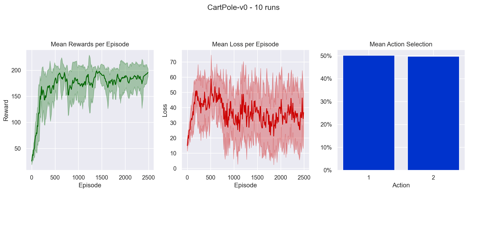
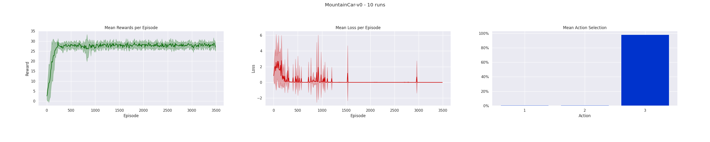
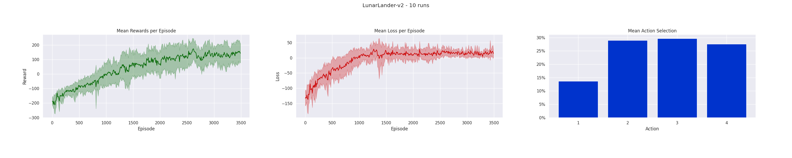

# REINFORCE

Some scripts for solving simple gym environments using the REINFORCE algorithm. I haven't figured out how to train it for the MountainCar environment yet, maybe I have to use a different algorithm (like DQN) or change the reward modeling.

## Cart-Pole

## Mountain-Car

## Lunar-Lander

